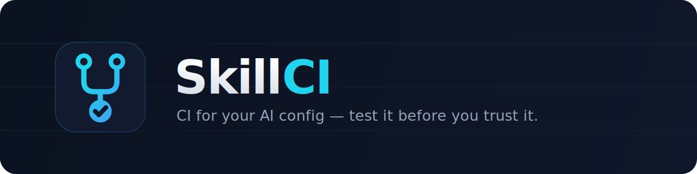

<div align="center">



<p><strong>CI/CD for coding-agent configuration.</strong><br/>
Test, score, and gate changes to your skills, hooks, rules, and <code>CLAUDE.md</code><br/>
<em>before</em> you trust them in Claude Code, Cursor, or Codex.</p>

<p><strong><a href="https://doramirdor.github.io/skillci/">🌐 Website</a></strong> ·
<a href="./docs/">Docs</a> ·
<a href="./docs/getting-started.md">Getting Started</a></p>

<p>
  
  
  
  
  
  
</p>

</div>

<div align="center">


</div>

---

## Why

You wouldn't merge an untested code change. Yet teams ship changes to the
configuration that *steers* their coding agents — `CLAUDE.md`, skills, hooks,
cursor rules, slash commands — on **vibes**, with zero testing.

A new instruction in a shared `CLAUDE.md` can quietly make the agent slower,
pricier, or worse at the job, and nobody notices for weeks. Agent config is now
a production artifact. **SkillCI is regression testing for it.**

## What it does

```
          ┌─ baseline config ─┐                      ┌──────────┐
 tasks ──►│                   ├─► run agent ─► score ─┤ compare  ├─► VERDICT
          └─ candidate config ┘   (sandboxed)         └──────────┘   improved /
                                                                     neutral /
                                                                     regressed
```

1. A **candidate** is a proposed change to one or more agent config artifacts.
2. SkillCI runs a suite of sandboxed repo **tasks twice** — once with the
   **baseline** (trusted) config, once with the **candidate**.
3. Each run drives a real coding agent **headlessly** in an isolated fixture repo.
4. Every outcome is scored three ways (below) and aggregated into one composite.
5. A **comparator** emits a verdict — `improved` / `neutral` / `regressed` — with
   an explicit list of any regressions.
6. A **pull request opens ONLY** when the verdict is `improved` with **zero hard
   regressions**. Otherwise the gate blocks.

### Three scoring dimensions

| Dimension | What it measures |
| --------- | ---------------- |
| **Objective** | Deterministic pass/fail: command exit codes, file existence/contents, test suites, expected diffs. |
| **LLM-as-judge** | Rubric-scored qualitative judgment for what objective checks can't capture. |
| **Cost / efficiency** | Tokens, tool calls, steps, wall-clock — a cheaper candidate is rewarded; a pricier one penalized. |

## Quickstart (offline, zero cost)

```bash
npm install
npm run demo      # deterministic end-to-end run via the mock adapter — no network, no keys
npm test          # 225 tests, fully offline
npm run typecheck
```

The demo runs the whole pipeline (discover → sandbox → run → score → compare →
verdict → PR dry-run) with a deterministic `MockAgentAdapter`. No API key, no
network.

## Live mode — runs on a Claude subscription, no API key

SkillCI drives **real Claude Code** through the `claude` CLI, so it works on a
Claude Code **subscription / OAuth session with no `ANTHROPIC_API_KEY`**:

```bash
# Build the CLI
npm run build

# Evaluate a candidate config against the baseline, live
node dist/cli/index.js run \
  --agent claude-code \
  --baseline ./config/baseline \
  --candidate ./config/candidate
```

- **Agent runs** via `claude -p "<prompt>" --output-format json --dangerously-skip-permissions`
  inside a disposable sandbox.
- **The LLM judge** also runs through `claude -p` when no `ANTHROPIC_API_KEY` is
  present — so the *entire* pipeline (agent **and** judge) works on a
  subscription. Set `ANTHROPIC_API_KEY` to route the judge through the Anthropic
  SDK instead.

> Exit code is a CI gate: **non-zero only when the verdict is `regressed`.**

## Use it as a PR gate (GitHub Action)

Drop this in to evaluate every PR that touches your agent config. A ready-to-copy
template lives at
[`examples/skillci-gate.yml`](examples/skillci-gate.yml):

```yaml
name: skillci-gate
on:
  pull_request:
    paths: ['.claude/**', 'CLAUDE.md', '.cursor/**', 'AGENTS.md']
jobs:
  gate:
    runs-on: ubuntu-latest
    steps:
      - uses: actions/checkout@v4
      - uses: actions/setup-node@v4
        with: { node-version: 20 }
      - run: npm ci && npm run build
      - run: node dist/cli/index.js run --agent claude-code
              --baseline <trusted-config> --candidate <pr-config>
        env:
          ANTHROPIC_API_KEY: ${{ secrets.ANTHROPIC_API_KEY }}  # optional — enables SDK judge
```

The job fails (blocking merge) only when the candidate **regresses**.

## CLI

| Command | What it does |
| ------- | ------------ |
| `skillci run` | Baseline-vs-candidate evaluation (or `--demo` for the offline run). |
| `skillci validate <dir>` | Discover & validate config artifacts for an agent in a directory. |
| `skillci tasks` | List available task definitions. |

Key `run` flags: `--agent <claude-code\|cursor\|codex>`, `--baseline <dir>`,
`--candidate <dir>`, `--tasks <dir>`, `--demo`, `--open-pr`, `--no-color`.

## Supported agents

| Agent | Artifacts | Headless invocation |
| ----- | --------- | ------------------- |
| **Claude Code** | skills, hooks, slash commands, `CLAUDE.md`, `.claude/settings.json` | `claude -p "<prompt>" --output-format json` *(subscription or API key)* |
| **Cursor** | `.cursor/rules/*.mdc`, `.cursorrules` | `cursor-agent` CLI *(best-effort)* |
| **Codex** | `AGENTS.md` / codex config | `codex exec` *(needs `OPENAI_API_KEY`)* |

Real adapters activate only when their CLI/auth is present and **degrade
gracefully** otherwise; everything falls back to the deterministic mock.

## Architecture

Self-contained modules, each in its own directory with colocated tests, all
compiling against the shared contracts in
[`src/core/contracts.ts`](src/core/contracts.ts).

| Module | Responsibility |
| ------ | -------------- |
| `core` | Canonical type contracts + zod schemas for the whole domain. |
| `artifacts` | Discover & normalize agent config into `Artifact` / `ConfigSet`. |
| `sandbox` | Create isolated fixture workdirs, run commands, compute file diffs. |
| `agents` | Agent adapters (Claude / Cursor / Codex + deterministic mock). |
| `tasks` | Load & validate task suites and fixtures. |
| `scoring` | Objective checks, LLM judge (SDK **or** `claude -p`), cost telemetry. |
| `compare` | Aggregate scores, compute deltas, emit the verdict; `shouldPromote()`. |
| `report` | Render JSON / markdown / colorized terminal reports. |
| `pr` | Open a GitHub PR (via `gh`) — dry-run by default, gated on verdict. |
| `cli` / `orchestrator` | Wire it together; the `skillci` commands. |

## The regression gate (fail-closed)

The promote decision is intentionally conservative. A candidate is **blocked**
if any of these hold:

- An **objective pass-rate drop** on any task (hard rule).
- A **dropped task** (present in baseline, missing in candidate).
- Aggregate composite gain **≤ `minCompositeGain`**.
- Any `NaN` / non-finite score.

Promotion requires `improved` **and** zero hard regressions.

## Status & roadmap

SkillCI is an **MVP**, verified end-to-end live (agent + judge) on a Claude
subscription. Honest about where it stands:

- ✅ Full pipeline runs live and offline; 225 tests; offline demo deterministic.
- ✅ Claude Code adapter + dual-backend judge (SDK / CLI) live-verified.
- 🚧 **Verdict variance** — real agent runs are non-deterministic; multi-run
  averaging + a cost-tolerance band are needed before unattended auto-promotion.
- 🚧 Cursor / Codex adapters are implemented but not yet live-validated.
- 🚧 Larger task/fixture libraries; container sandbox backend; hosted dashboards.

## Documentation

Full guides live in [`docs/`](./docs/):

- [Getting Started](./docs/getting-started.md) — install, offline demo, first live run
- [Concepts](./docs/concepts.md) — baseline/candidate, verdict model, the gate
- [CLI Reference](./docs/cli-reference.md) · [Writing Tasks](./docs/writing-tasks.md) · [Scoring](./docs/scoring.md)
- [Agents & Auth](./docs/agents-and-auth.md) · [CI Integration](./docs/ci-integration.md)
- [Architecture](./docs/architecture.md) · [Troubleshooting](./docs/troubleshooting.md)

## Development

```bash
npm run dev          # tsx watch
npm run test:watch   # vitest watch
npm run build        # emit dist/ (compiled CLI bin)
```

See [CONTRIBUTING.md](CONTRIBUTING.md).

## License

[MIT](LICENSE)
